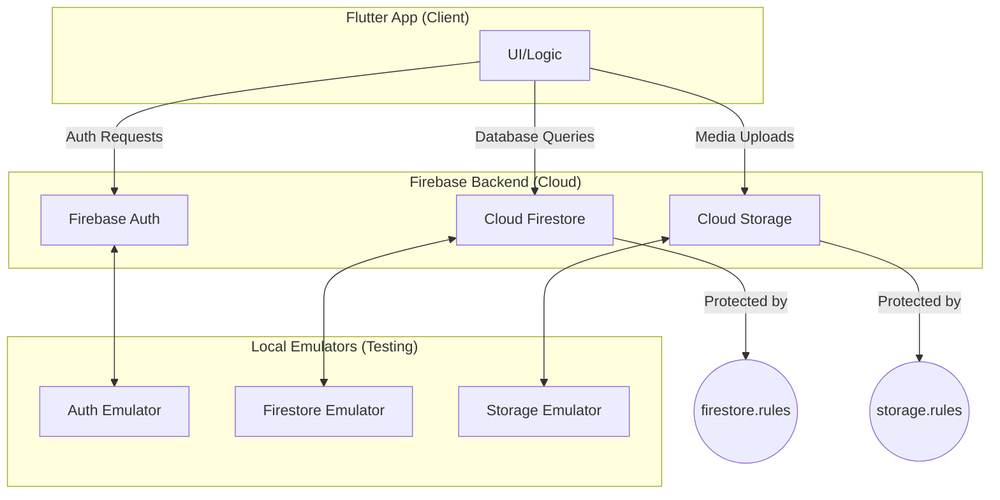

# Phase 2.1: Data Layer & Security Implementation Report

*Generated June 24, 2025*

---

## 1. Overview

This report details the work completed for Phase 2, Step 1 of the MarketSnap Lite MVP, focusing on establishing the core data layer, including Firestore schema, security rules, and local emulator setup. This phase provides the secure foundation for all subsequent backend and frontend development.

---

## 2. Feature Implementation

The following tasks from `documentation/MarketSnap_Lite_MVP_Checklist_Simple.md` have been completed:

-   **[X] 1. Firestore Schema & Security**
    -   [X] Define collections: `vendors`, `snaps`, `broadcasts`, `followers` with indexes.
    -   [X] Write Firebase rules restricting each document to `request.auth.uid` vendor.
    -   [X] Add emulator test verifying unauthenticated write is rejected.

---

## 3. File & Architecture Changes

The following files were created or modified to set up the Firebase project structure and data layer:

| File Path                  | Purpose                                                                                                                              |
| -------------------------- | ------------------------------------------------------------------------------------------------------------------------------------ |
| `firebase.json`            | Configures the project for Firebase, defining locations for rules files and settings for local emulators (Firestore, Auth, Storage). |
| `firestore.rules`          | Implements security rules for all Firestore collections, restricting data access to authorized users.                                |
| `firestore.indexes.json`   | Defines composite indexes for Firestore to enable efficient querying on collections like `snaps` and `broadcasts`.                   |
| `storage.rules`            | Implements security rules for Cloud Storage, ensuring vendors can only upload media to their own directory with a 1MB size limit.    |
| `.firebaserc`              | Associates the local project directory with the `marketsnap-app` Firebase project.                                                     |
| `functions/`               | New directory initialized to house all backend Cloud Functions, using TypeScript with ESLint for code quality.                         |
| `.gitignore`               | Updated to ensure sensitive configuration files like `firebase.json` and generated files are not committed to version control.       |

### Architecture Diagram

The current architecture enables secure, offline-first data synchronization between the Flutter app and the Firebase backend.

---

## 4. Firebase Configuration & Security

### Firebase Initialization

The project was successfully initialized using the `firebase init` command, linking it to the `marketsnap-app` project and setting up:
-   **Firestore:** Rules and indexes.
-   **Functions:** A new TypeScript codebase.
-   **Storage:** A rules file.
-   **Emulators:** For Auth, Firestore, Functions, and Storage.

### Security Rules Highlights

-   **`firestore.rules`**:
    -   Default access is denied.
    -   `vendors`, `snaps`, and `broadcasts` collections can only be written to by the authenticated user (`request.auth.uid`) who owns the data.
    -   Read access is generally public to allow followers to view content.
-   **`storage.rules`**:
    -   Media uploads are restricted to the `/vendors/{userId}/snaps/` path.
    -   The `userId` in the path must match the `request.auth.uid` of the uploader.
    -   A strict file size limit of **1 MB** is enforced on all uploads to manage costs and bandwidth.

### Emulator Testing

Local emulators were started using `firebase emulators:start`. A `curl` command was used to send an unauthenticated `POST` request to the Firestore emulator. The request was successfully rejected with a `403 Forbidden` error, verifying that the security rules are correctly enforced.

---

## 5. Next Steps

With the data layer and security foundation now in place, the project is ready to proceed with subsequent development phases:

-   **Phase 2, Step 2:** Implement Storage bucket policies, including the 30-day TTL rule for automatic media deletion.
-   **Phase 3:** Begin development of the user-facing interface, connecting the UI to the now-secure backend.

This foundational work ensures that as new features are added, they will be built upon a secure and scalable data architecture. 