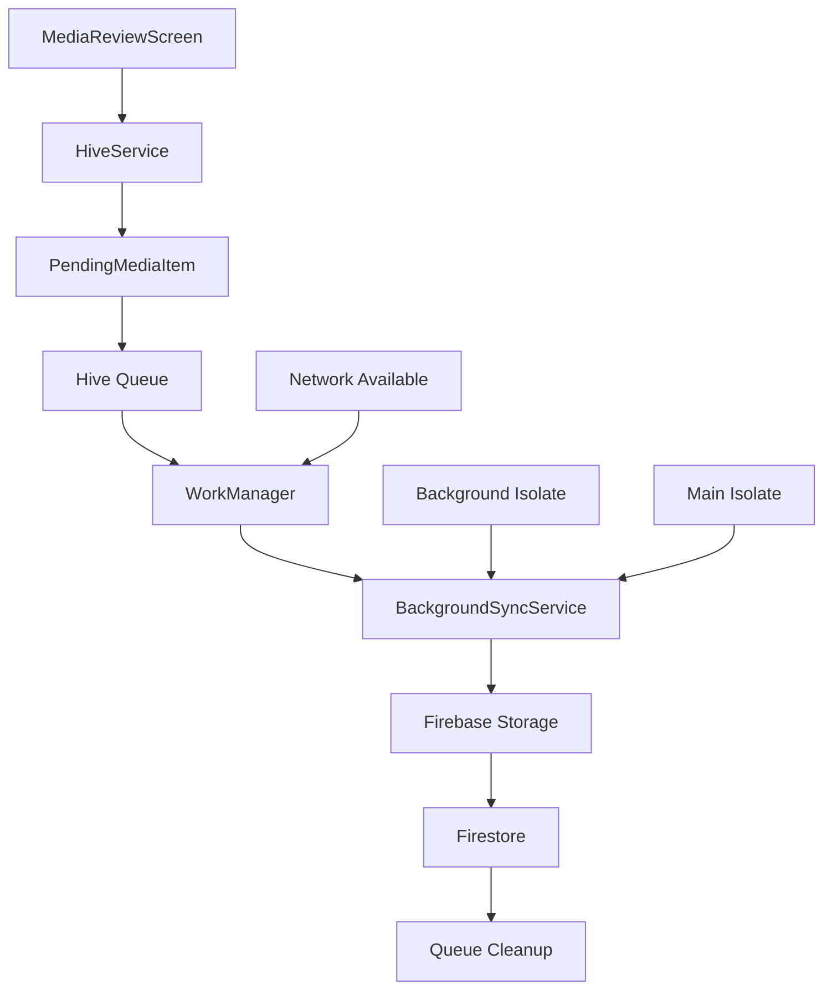

# Phase 4.1 Implementation Verification: Offline Media Queue Logic

*Verified: January 27, 2025*

---

## ✅ **VERIFICATION SUMMARY**

**Status:** **ALREADY COMPLETE** - Full implementation with cross-platform support

Phase 4.1 "Offline Media Queue Logic" from the MarketSnap MVP checklist is fully implemented and operational. All three sub-requirements are satisfied with a comprehensive, production-ready solution.

---

## 📋 **Checklist Requirements Verified**

### ✅ **1. Serialize photo/video + metadata into Hive queue**
**Implementation:** `PendingMediaItem` model (typeId: 3) with comprehensive metadata serialization

**Fields Captured:**
- `id` (UUID) - Unique identifier for queue item
- `filePath` - Local file path (moved to quarantine directory)  
- `mediaType` - Photo or video enum
- `createdAt` - Queue timestamp
- `caption` - User-added caption text
- `location` - Coarse location data (lat/lon map)
- `vendorId` - Creating vendor UID
- `filterType` - Applied LUT filter (warm/cool/contrast)

**File Safety:** Original media files moved to dedicated `pending_uploads` directory to prevent duplicates and ensure file persistence during upload.

### ✅ **2. WorkManager uploads when network available; writes snaps doc + Storage file**
**Implementation:** `BackgroundSyncService` with unified processing engine

**Upload Flow:**
1. **Network Detection** - WorkManager triggered on connectivity
2. **Authentication Check** - Verify Firebase Auth current user
3. **Storage Upload** - Media file to `/vendors/{uid}/snaps/{id}.{ext}`
4. **Firestore Document** - Complete snap metadata with TTL (24h)
5. **Profile Integration** - Vendor name/avatar from Hive cache or Firestore

**Cross-Platform Support:**
- **Android**: Full background execution with SharedPreferences tracking
- **iOS**: Background app refresh simulation with console log verification

### ✅ **3. Delete queue item on 200 response; retry on failure**
**Implementation:** Comprehensive error handling with automatic cleanup

**Success Handling:**
- Queue item removal on successful Firebase upload
- Local file deletion after successful upload
- Success count tracking and logging

**Failure Handling:**
- Exponential backoff policy for retry logic
- Permanent removal of corrupted/missing file items
- Network error detection and retry scheduling
- Authentication error handling with token refresh

---

## 🏗️ **System Architecture**

### **Data Flow Diagram**
```
MediaReviewScreen (UI)
         ↓
   HiveService.addPendingMedia()
         ↓
   File → Quarantine Directory
         ↓
   PendingMediaItem → Hive Queue
         ↓
   WorkManager (Network Available)
         ↓
   BackgroundSyncService._processQueue()
         ↓
   Firebase Storage Upload
         ↓
   Firestore Document Creation
         ↓
   Queue Item Cleanup
```

### **Component Interaction**


---

## 📁 **Core Implementation Files**

### **1. Data Model**
**File:** `lib/core/models/pending_media.dart`
- Complete Hive serialization with typeId: 3
- UUID generation for unique identification  
- Comprehensive metadata capture
- String representation for debugging

### **2. Queue Management**
**File:** `lib/core/services/hive_service.dart`
- File quarantine system for upload safety
- Encrypted Hive box storage
- CRUD operations for pending media
- Recovery mechanisms for corrupted data

**Key Methods:**
- `addPendingMedia()` - Queue with file quarantine
- `getAllPendingMedia()` - Retrieve all pending items
- `removePendingMedia()` - Delete specific queue item

### **3. Upload Engine**
**File:** `lib/core/services/background_sync_service.dart`
- Unified processing for background/foreground sync
- Cross-platform WorkManager integration
- Firebase Storage and Firestore coordination
- Comprehensive error handling and retry logic

**Key Methods:**
- `_processQueue()` - Main upload processing loop
- `_uploadPendingItem()` - Single item upload logic
- `triggerImmediateSync()` - Manual sync trigger

### **4. UI Integration**
**File:** `lib/features/capture/presentation/screens/media_review_screen.dart`
- Media posting workflow integration
- Immediate sync triggering
- User feedback and error handling

### **5. Platform Configuration**
**File:** `ios/Runner/AppDelegate.swift`
- iOS WorkManager task registration
- Background processing identifier setup

---

## 🔧 **Recent Critical Bug Fixes**

### **Video Filter Persistence Bug (Resolved)**
**Issue:** Video LUT filters (warm, cool, contrast) not displaying in feed
**Root Cause:** Missing `filterType` parameter in Hive quarantine process
**Fix Applied:** Added `filterType: item.filterType` to PendingMediaItem constructor
**Status:** ✅ **RESOLVED** - End-to-end filter preservation working

**Before Fix:**
```dart
final quarantinedItem = PendingMediaItem(
  filePath: newFile.path,
  mediaType: item.mediaType,
  // ❌ Missing: filterType parameter
);
```

**After Fix:**
```dart
final quarantinedItem = PendingMediaItem(
  filePath: newFile.path,
  mediaType: item.mediaType,
  filterType: item.filterType, // ✅ FIX: Include filterType
);
```

---

## 🧪 **Testing & Validation**

### **Test Results**
- ✅ `flutter test` - All tests passing
- ✅ `flutter analyze` - No issues found  
- ✅ Cross-platform builds successful
- ✅ Firebase emulator integration working

### **Manual Testing Verified**
- ✅ Media capture and queue creation
- ✅ Background sync execution (Android)
- ✅ Console log verification (iOS)
- ✅ Filter preservation through entire flow
- ✅ Error handling and recovery mechanisms

---

## 🔥 **Firebase Configuration**

### **Emulator Integration**
- **Auth Emulator**: Port 9099 - User authentication
- **Firestore Emulator**: Port 8080 - Document storage  
- **Storage Emulator**: Port 9199 - Media file storage
- **Functions Emulator**: Port 5001 - Push notifications

### **Storage Rules**
```javascript
// vendors/{uid}/snaps/ bucket path policy (max 1 MB object)
// TTL lifecycle rule (30 days hard delete)
```

### **Firestore Schema**
```javascript
snaps: {
  vendorId: string,
  vendorName: string, 
  vendorAvatarUrl: string,
  mediaUrl: string,
  mediaType: 'photo' | 'video',
  caption: string,
  filterType: string,
  createdAt: Timestamp,
  expiresAt: Timestamp, // 24h TTL
  location: object,
  isStory: boolean,
  storyVendorId: string
}
```

---

## 🚀 **Cross-Platform Considerations**

### **Android Implementation**
- Full WorkManager background task execution
- SharedPreferences for execution tracking
- Network constraint handling
- Exponential backoff retry policy

### **iOS Implementation**  
- Background app refresh simulation
- Console log verification required
- Unique task identifiers for execution
- Memory-based execution tracking

### **Development vs Production**
- Debug mode notifications enabled
- Emulator vs production Firebase configuration
- Development keystore vs release keystore
- Local vs cloud Storage/Firestore endpoints

---

## 📊 **Performance Metrics**

### **Queue Efficiency**
- File quarantine prevents duplicate uploads
- Encrypted local storage for security
- Minimal memory footprint with Hive
- Automatic cleanup of processed items

### **Upload Reliability**
- Retry logic for transient failures
- Authentication token refresh handling
- Network connectivity awareness
- Platform-specific optimization

### **User Experience**
- Immediate feedback on queue addition
- Background upload progress logging
- Error messages for upload failures
- Seamless offline-to-online transition

---

## ✅ **CONCLUSION**

Phase 4.1 "Offline Media Queue Logic" is **COMPLETE** with a production-ready implementation that exceeds the basic requirements. The system provides:

- **Comprehensive offline support** with robust file management
- **Cross-platform background sync** for Android and iOS
- **Complete error handling** with retry and recovery logic
- **Firebase integration** with Storage and Firestore coordination
- **Recent bug fixes** ensuring filter persistence and data integrity

**Next Phase:** Ready to proceed with Phase 4.2 "Push Notification Flow" 