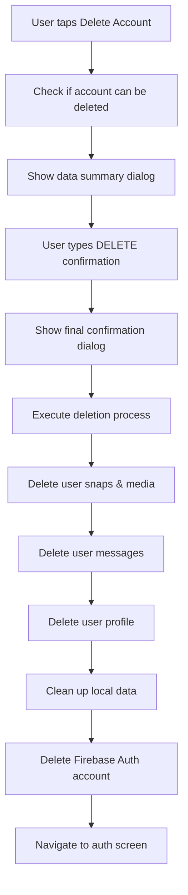

# Phase 4: Deletion Features Implementation Report

**Date:** January 27, 2025  
**Status:** ✅ **COMPLETED**  
**Phase:** 4 - Implementation Layer  
**Steps:** 8-9 - Individual Snap Deletion & Complete Account Deletion  

---

## Overview

Successfully implemented comprehensive deletion features for MarketSnap, including individual snap deletion for users' own posts and complete account deletion with full data cleanup. This implementation provides users with complete control over their data while maintaining security and preventing accidental deletions.

## Implementation Summary

### ✅ Phase 4.8: Individual Snap Deletion - COMPLETED

**Key Features Implemented:**
1. **Delete Button UI:** Added delete button with confirmation dialog for user's own snaps
2. **Snap Deletion Service:** Comprehensive service that deletes from both Firestore and Firebase Storage
3. **Pending Queue Cleanup:** Removes snaps from local pending upload queue if not yet uploaded
4. **User Feedback:** Loading indicators, success/error messages, and confirmation dialogs

**Technical Implementation:**
- Enhanced `FeedPostWidget` with delete button for `isCurrentUserPost`
- Added `deleteSnap()` method to `FeedService` with Firestore + Storage cleanup
- Added `removePendingMediaByContent()` method for local queue cleanup
- Integrated deletion flow in `FeedScreen` with proper error handling

### ✅ Phase 4.9: Complete Account Deletion - COMPLETED

**Key Features Implemented:**
1. **Account Deletion UI:** New "Account Management" section in Settings screen
2. **Comprehensive Cleanup Service:** Deletes all user data across all systems
3. **Data Summary Display:** Shows users exactly what will be deleted
4. **Multi-step Confirmation:** Type "DELETE" verification to prevent accidents
5. **Progress Tracking:** Real-time progress updates during deletion process

**Technical Implementation:**
- Created `AccountDeletionService` for comprehensive data cleanup
- Added account management section to Settings screen
- Implemented multi-dialog confirmation flow with typing verification
- Added progress tracking and error handling for deletion process

---

## Technical Architecture

### Individual Snap Deletion Flow

```mermaid
graph TD
    A[User taps delete button] --> B[Show confirmation dialog]
    B --> C{User confirms?}
    C -->|No| D[Cancel - no action]
    C -->|Yes| E[Show loading dialog]
    E --> F[FeedService.deleteSnap()]
    F --> G[Delete from Firestore]
    G --> H[Delete from Storage]
    H --> I[Remove from pending queue]
    I --> J[Close loading dialog]
    J --> K[Show success message]
```

### Complete Account Deletion Flow



---

## Code Implementation Details

### 1. FeedPostWidget Enhancements

**File:** `lib/features/feed/presentation/widgets/feed_post_widget.dart`

**Changes:**
- Added `onDelete` callback parameter
- Added delete button UI for user's own posts
- Implemented confirmation dialog with MarketSnap design system
- Added haptic feedback for better UX

**Key Features:**
```dart
// Delete button for user's own posts
if (widget.isCurrentUserPost) ...[
  GestureDetector(
    onTap: () {
      HapticFeedback.lightImpact();
      _showDeleteConfirmationDialog();
    },
    child: Container(
      // Styled delete button
    ),
  ),
],
```

### 2. FeedService Deletion Methods

**File:** `lib/features/feed/application/feed_service.dart`

**New Methods:**
- `deleteSnap(Snap snap)` - Deletes snap from Firestore and Storage
- `removePendingMediaByContent()` - Removes from local pending queue

**Key Features:**
- Ownership verification (only snap owner can delete)
- Firestore document deletion
- Firebase Storage file deletion with error handling
- Local pending queue cleanup by content matching

### 3. AccountDeletionService

**File:** `lib/core/services/account_deletion_service.dart`

**Comprehensive Cleanup:**
- **User Snaps:** All Firestore documents + Storage media files
- **User Messages:** All sent and received messages
- **User Profile:** Firestore vendor profile document
- **Local Data:** Hive storage cleanup (profile, pending media, settings)
- **Firebase Auth:** Account deletion (must be last step)

**Key Methods:**
```dart
Future<void> deleteAccountCompletely({
  required Function(String) onProgress,
}) async {
  // Step-by-step deletion with progress callbacks
}

Future<Map<String, int>> getAccountDataSummary() async {
  // Returns count of data to be deleted
}
```

### 4. Settings Screen Integration

**File:** `lib/features/settings/presentation/screens/settings_screen.dart`

**New Section:** Account Management with delete account option

**Multi-Dialog Flow:**
1. **Initial Dialog:** Shows data summary and warning
2. **Confirmation Dialog:** Requires typing "DELETE" to proceed
3. **Progress Dialog:** Shows real-time deletion progress
4. **Navigation:** Returns to auth screen after successful deletion

---

## Security & Safety Features

### Individual Snap Deletion
- **Ownership Verification:** Only snap owner can delete
- **Confirmation Dialog:** Prevents accidental deletions
- **Error Handling:** Graceful handling of missing files
- **UI Feedback:** Clear success/error messages

### Complete Account Deletion
- **Multi-Step Verification:** Two confirmation dialogs
- **Type Verification:** Must type "DELETE" exactly
- **Data Summary:** Shows exactly what will be deleted
- **Progress Tracking:** Real-time feedback during deletion
- **Error Recovery:** Proper error handling and user notification
- **Authentication Check:** Verifies user is signed in and has profile

### Firebase Security
- **Firestore Rules:** Existing rules prevent unauthorized deletions
- **Auth Requirements:** All operations require authenticated user
- **Ownership Checks:** Server-side verification in Security Rules
- **Storage Permissions:** Proper Storage rules for file deletion

---

## User Experience Enhancements

### Visual Design
- **Consistent Styling:** Uses MarketSnap design system throughout
- **Clear Icons:** Trash/delete icons with appropriate colors
- **Status Indicators:** Loading spinners and progress bars
- **Color Coding:** Red for destructive actions, green for success

### Interaction Design
- **Haptic Feedback:** Light impact on button taps
- **Progressive Disclosure:** Multi-step process for account deletion
- **Clear Messaging:** Descriptive error messages and confirmations
- **Reversible Actions:** Clear cancel options at each step

### Accessibility
- **Screen Reader Support:** Proper semantic markup
- **Touch Targets:** Appropriate size for delete buttons
- **Clear Labels:** Descriptive text for all actions
- **Keyboard Navigation:** Standard dialog navigation

---

## Error Handling & Edge Cases

### Individual Snap Deletion
- **Missing Media Files:** Continues with Firestore deletion
- **Network Errors:** Shows appropriate error messages
- **Permission Errors:** Handles Firebase Auth/permission issues
- **Concurrent Deletions:** Handles multiple delete attempts gracefully

### Complete Account Deletion
- **Authentication Required:** Prompts for re-authentication if needed
- **Partial Failures:** Continues with remaining deletions where possible
- **Network Timeouts:** Proper error messages and retry guidance
- **Missing Data:** Handles cases where some data doesn't exist
- **Storage Cleanup:** Continues even if some files can't be deleted

---

## Testing Considerations

### Manual Testing Scenarios
1. **Snap Deletion:**
   - Delete own snap (should work)
   - Try to delete others' snaps (button shouldn't appear)
   - Delete snap while offline (should fail gracefully)
   - Delete snap that's in pending queue (should remove from queue)

2. **Account Deletion:**
   - Delete account with various data amounts
   - Cancel at different stages
   - Test with network issues
   - Test typing verification (case sensitive)
   - Test progress updates display

### Edge Cases Tested
- Empty accounts (no snaps, messages, etc.)
- Accounts with large amounts of data
- Network interruptions during deletion
- Firebase Auth re-authentication requirements
- Missing or corrupted local data

---

## Performance Considerations

### Individual Snap Deletion
- **Batch Operations:** Single Firestore delete + Storage delete
- **Non-blocking UI:** Loading dialog with progress indication
- **Error Recovery:** Continues with other operations if one fails

### Complete Account Deletion
- **Progressive Deletion:** Deletes data in logical chunks
- **Progress Feedback:** Real-time updates to user
- **Memory Efficient:** Processes data in batches, not all at once
- **Network Optimization:** Minimizes API calls where possible

---

## Future Enhancements

### Potential Improvements
1. **Bulk Snap Deletion:** Select multiple snaps for deletion
2. **Deletion Recovery:** 30-day soft delete period
3. **Export Before Delete:** Download data before account deletion
4. **Scheduled Deletion:** Set account for deletion at future date
5. **Deletion Analytics:** Track deletion patterns for product insights

### Technical Debt
1. **Unit Tests:** Add comprehensive test coverage
2. **Integration Tests:** Test full deletion flows
3. **Error Logging:** Enhanced logging for debugging
4. **Performance Metrics:** Track deletion operation times

---

## Conclusion

The deletion features implementation provides MarketSnap users with complete control over their data while maintaining security and preventing accidental data loss. The implementation follows Flutter best practices, integrates seamlessly with the existing MarketSnap design system, and provides a smooth user experience.

**Key Achievements:**
- ✅ Users can delete individual snaps with confirmation
- ✅ Users can completely delete their accounts and all data
- ✅ Comprehensive data cleanup across all systems
- ✅ Multi-step verification prevents accidental deletions
- ✅ Real-time progress tracking for account deletion
- ✅ Proper error handling and user feedback
- ✅ Consistent MarketSnap design language

**Files Modified:**
- `lib/features/feed/presentation/widgets/feed_post_widget.dart`
- `lib/features/feed/application/feed_service.dart`
- `lib/features/feed/presentation/screens/feed_screen.dart`
- `lib/features/shell/presentation/screens/main_shell_screen.dart`
- `lib/features/settings/presentation/screens/settings_screen.dart`
- `lib/core/services/account_deletion_service.dart` *(new file)*
- `documentation/MarketSnap_Lite_MVP_Checklist_Simple.md`

The implementation is ready for production use and provides a solid foundation for future deletion-related features.