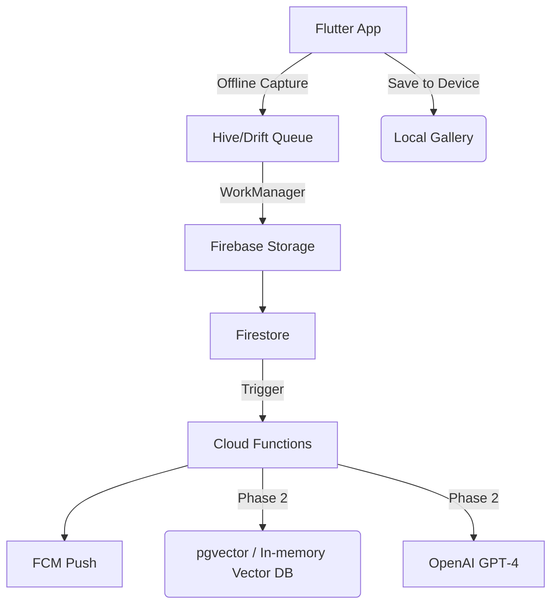

# Product Requirements Document (PRD)  
### **MarketSnap Lite — Offline‑Friendly Snapchat for Farmers‑Market Vendors**  
*(v1.1 — June 24, 2025)*  

---

## 1 · Project Overview  
MarketSnap Lite is a **vendor‑centric mobile app** (Flutter 3) that lets farmers‑market sellers post *offline‑first* photo **snaps** and **5‑second video clips**. Content syncs automatically once a connection is available, pushes followers to visit the stall before produce sells out, and expires after 24 h. Vendors may optionally **save a local copy** of any post to their phone for future reuse (the cloud copy still self‑deletes).  
Phase 2 adds time‑saving AI helpers (auto‑captions, recipe snippets, FAQ cards) once the core flow is proven.

---

## 2 · Goals & Success Metrics  

| Goal | Metric | Target |
|------|--------|--------|
| Reliable posting in patchy networks | Snap/clip uploaded within **≤ 15 min** of connectivity return | 95‑th percentile |
| Urgency & engagement | ≥ 40 % of followers open a push‑pinged snap within 30 min | Post‑MVP |
| Performance | Median online sync latency **< 3 s** | Firebase Performance |
| Bandwidth budgets | Photo ≤ 200 kB; 5‑s video ≤ 1 MB (after compression) | App instrumentation |
| AI utility (Phase 2) | ≥ 70 % of vendors tap “Magic Caption” per market day | Mixpanel funnel |

---

## 3 · Target Audience  

| Persona | Needs & Pain Points |
|---------|--------------------|
| **Local Vendor “Lena”** (primary) | Patchy data; limited marketing time; wants fast way to announce fresh stock and last‑call offers. |
| **Market Shopper “Sam”** (secondary) | Loves fresh produce; wants real‑time, low‑data updates; values privacy. |

---

## 4 · Assumptions & Constraints  

* Flutter + Firebase chosen for rapid cross‑platform dev and offline cache.  
* Vendors may be on 3G or offline periodically.  
* Privacy defaults to minimal: vendor coarse location optional; shopper GPS never captured.  
* **Vendors can tap “Save to Device” to keep local copies after the 24 h expiry; saved media never re‑uploads.**  
* **No web portal for coordinators — vendor onboarding is self‑serve in‑app.**  
* **Infra spend capped at ≈ US $25/mo during pilot; pgvector on a micro Postgres instance preferred.**  
* 5‑second videos are mandatory (G2P2 spec) and must auto‑compress on‑device.

---

## 5 · User Stories  

| # | User Story | Features Utilised |
|---|---|---|
| **1** | **Offline Photo Snap** — *As a vendor with spotty signal, I want to take a photo and see it land in a “Pending Upload” queue, so my post isn't lost and shoppers are notified once I reconnect.* | Camera → Offline Queue → Sync + Push → Feed |
| **2** | **5‑Second Video Teaser** — *I want to record a 5‑sec clip auto‑compressed to ≤ 1 MB and added to my story reel.* | Video Capture + Compression → Queue → Story |
| **3** | **One‑Tap AI Caption & Filter** — *I want "Magic Caption" and a warm filter so my snap pops with zero typing.* | AI Caption Helper → Filters |
| **4** | **Location‑Tagged Snap** — *I want to toggle "Show Market Location" so nearby shoppers find me.* | Coarse Location Tag → Discovery |
| **5** | **"Almost Gone" Broadcast** — *I want to send a 6‑h expiring text blast ("5 baskets left!") to nudge followers.* | Broadcast Text → Push |
| **6** | **Recipe & FAQ Booster (Phase 2)** — *I want to attach an AI recipe snippet and quick FAQ card for shoppers.* | AI Snippet → FAQ Cards |
| **7** | **Keep a Personal Copy** — *I want a one‑tap "Save to Phone" after posting, so I can reuse media later even though the cloud version auto‑deletes.* | Local Gallery Export |
| **8** | **Ephemeral Vendor-Shopper Message** — *As a shopper, I want to chat with a vendor and have messages disappear after 24 h, so our conversation stays private and relevant.* | Direct Messaging → FCM Push |

---

## 6 · Feature Scope & Phasing  

| Phase | Time‑box | Features |
|-------|----------|----------|
| **Core / MVP** | Days 1-5 | Auth & Profile · Offline Photo/Video Queue · Auto‑Sync + Push · Story Reel · Low‑Bandwidth Filters · Follower Feed · Broadcast Text · Coarse Location · **Save to Device** · Settings/Help |
| **Polish** | Day 5 | Accessibility, UI polish, Firebase Perf, Crashlytics, **Ephemeral Messaging (DM)** |
| **Phase 2 (AI)** | Days 6‑7 | AI Caption Helper · Recipe Snippets · FAQ Vector Search |

---

## 7 · Functional Requirements  

| ID | Requirement |
|----|-------------|
| FR‑1 | Vendor registers / logs in via phone # or email (OTP). |
| FR‑2 | Capture photo *or* 5‑s video; if offline, store in local queue. |
| FR‑3 | Local queue retries upload until success (exponential back‑off). |
| FR‑4 | On upload success, followers receive FCM push. |
| FR‑5 | Media appears in vendor story reel; cloud copy auto‑deletes after 24 h. |
| FR‑6 | Vendors apply warm/cool/contrast LUT filters on‑device. |
| FR‑7 | Vendors send ≤ 100‑char broadcast text; expires after 6 h. |
| FR‑8 | Vendor toggles coarse location; lat/long rounded to 0.1°. |
| FR‑9 | App compresses video to H.264 ≤ 1 MB; fallback to photo if over. |
| FR‑10 | **Vendor taps "Save to Device" to export media to OS gallery (kept locally only).** |
| FR‑11 | (Phase 2) Vendor taps "Magic Caption" → caption returned ≤ 2 s. |
| FR‑12 | Vendor & shopper exchange 1-on-1 messages that auto-expire after 24 h. |

---

## 8 · Non‑Functional Requirements  

| Category | Requirement |
|----------|-------------|
| Performance | Median online sync < 3 s; offline upload ≤ 15 min after reconnect. |
| Reliability | Queue survives app kill / reboot; checksum integrity. |
| Security | Firebase Auth; Firestore rules per‑vendor UID. |
| Privacy | Vendor location optional; no shopper GPS; cloud media deleted on TTL. |
| Accessibility | OS font scaling; min contrast 4.5:1. |
| Storage | **Local export checks ≥ 100 MB free; warns if below.** |
| Cost | **Infra spend ≤ US $25/mo; pgvector micro Postgres or in‑memory fallback.** |

---

## 9 · Data Model (Firestore)  

| Collection | Key Fields |
|------------|-----------|
| **vendors** | uid, displayName, stallName, marketCity, avatarURL, allowLocation |
| **snaps** | snapId, vendorUid, mediaURL, mediaType {photo, video}, expiresAt, location, caption, filterType |
| **broadcasts** | broadcastId, vendorUid, text, createdAt, expiresAt |
| **followers** | vendorUid, followerUid |
| **faqVectors** (Phase 2) | vendorUid, chunkText, embedding |
| **messages** | messageId, conversationId, fromUid, toUid, text, createdAt, expiresAt, isRead |

---

## 10 · API / Cloud Functions  

| Function | Purpose | Cost Note |
|----------|---------|-----------|
| `sendFollowerPush` | On `snaps` create → FCM multicast | — |
| `fanOutBroadcast` | On `broadcasts` create → FCM | — |
| `generateCaption` (Phase 2) | GPT‑4 prompt → caption | — |
| `getRecipeSnippet` (Phase 2) | GPT‑4 prompt + recipe DB → snippet | — |
| `vectorSearchFAQ` (Phase 2) | FAQ similarity search | **pgvector micro instance ($7/mo) or in‑memory Annoy fallback** |
| `sendMessageNotification` | On `messages` create → FCM push | — |

---

## 11 · System Architecture  

---

## 12 · Milestones & Schedule  

| Day | Deliverable |
|-----|-------------|
| 1 | Auth & profile stub; queue POC |
| 2 | Photo + video capture; queue → storage; push MVP |
| 3 | Story reel UI; TTL GC job; filters |
| 4 | Feed; broadcast text; coarse location; Save‑to‑Device |
| 5 | Settings/help; QA; Perf & Crashlytics hooks; **Ephemeral Messaging POC** |
| 6 | AI caption helper function & UI |
| 7 | Recipe & FAQ snippet POC; final regression; deployment |

---

## 13 · Risks & Mitigations  

| Risk | Impact | Mitigation |
|------|--------|-----------|
| Video compression > 1 MB on older phones | Violates spec | Check size; fallback photo option |
| Queue corruption on app kill | Data loss | Persist in Hive; checksum |
| Push blocked by OS settings | Low engagement | Show "Sync Complete" banner in‑app |
| GPT‑4 latency > 2 s | Poor UX | Pre‑warm; cache per media hash |
| Vector DB cost overrun | Budget breach | **Cap rows; use pgvector micro tier; fallback to Annoy.** |
| Low device storage for local save | Save fails | Warn if < 100 MB free |

---

## 14 · Out of Scope (MVP)  

* Payments / tipping  
* Detailed analytics dashboards  
* Real‑time inventory counters  
* Advanced AR lenses beyond LUT filters  

---

## 15 · Open Question  

1. **Which free‑/low‑tier Postgres provider (e.g., Supabase, Neon) best fits our pgvector need within the ≈ $25/mo budget cap?**

---

**Prepared by **Product & Engineering — *June 2025*  
**Next step:** Stakeholder sign‑off → break Phase 1 work into GitHub issues.
