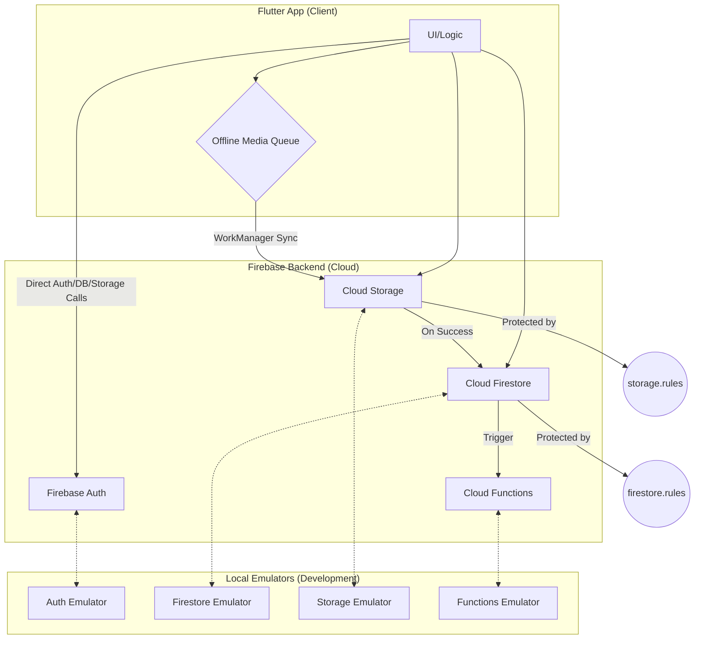

# System Patterns & Architecture

*Last Updated: June 24, 2025*

---

## Core Architecture: Offline-First, Vendor-Centric

The application is built on an offline-first architecture using Flutter for the cross-platform mobile client and Firebase for the backend. The core principle is to ensure vendors can capture and queue media even with poor or no network connectivity.



## Key Components & Patterns

1.  **Flutter Client:**
    -   **State Management:** Riverpod 2 / BLoC Cubit (To be finalized).
    -   **Local Persistence:** `hive` is used for the `pendingMediaQueue` and `userSettings` boxes, providing a fast and reliable local database.
    -   **Background Sync:** `workmanager` is used to create a robust background task that uploads queued media when network connectivity is restored. This is a critical component for the offline-first guarantee.

2.  **Firebase Backend:**
    -   **Authentication:** Firebase Auth is used for user management (Phone/Email OTP). The `request.auth.uid` is the cornerstone of our security rules.
    -   **Database:** Cloud Firestore stores all application metadata (`vendors`, `snaps`, `broadcasts`, `followers`). Access is tightly controlled by `firestore.rules`.
    -   **File Storage:** Cloud Storage is used to store user-generated media (photos/videos). `storage.rules` ensure that only authenticated users can upload to their designated, size-limited paths.
    -   **Serverless Logic:** Cloud Functions (written in TypeScript) are used for backend logic that should not run on the client, such as sending push notifications upon new snap creation.

3.  **Local Development Environment:**
    -   **Firebase Emulator Suite:** We use the full emulator suite for local development. This allows for rapid, offline testing of all backend components, including security rules, database triggers, and functions.
    -   **Configuration:** The emulators are configured in `firebase.json`, with rules defined in `firestore.rules` and `storage.rules`.

## Asset Management
- **Static Assets**: All static assets are managed in the `assets/` directory at the project root.
- **Images**: General images are stored in `assets/images/`.
- **LUTs**: Look-Up Table (LUT) filter images are stored in `assets/images/luts/`. This keeps them organized and separate from other UI-related images.
- **Configuration**: All asset directories must be declared in `pubspec.yaml` under the `flutter.assets` section.

## Camera Implementation Patterns

### Full-Screen Camera Preview Best Practices
Based on research and successful implementation, the correct approach for full-screen camera preview that matches user expectations from default camera apps:

**✅ CORRECT APPROACH - Device Ratio + BoxFit.cover:**
```dart
Widget _buildCameraPreview() {
  final controller = _cameraService.controller!;
  final size = MediaQuery.of(context).size;
  final deviceRatio = size.width / size.height;
  
  return ClipRect(
    child: OverflowBox(
      alignment: Alignment.center,
      child: FittedBox(
        fit: BoxFit.cover,
        child: SizedBox(
          width: size.width,
          height: size.width / deviceRatio, // Force device aspect ratio
          child: CameraPreview(controller),
        ),
      ),
    ),
  );
}
```

**❌ WRONG APPROACHES to Avoid:**
```dart
// ❌ Causes black bars/negative space:
return AspectRatio(
  aspectRatio: cameraRatio, // Using camera ratio instead of device ratio
  child: CameraPreview(controller),
);

// ❌ Causes zoom-in/stretched appearance:
return Transform.scale(
  scale: cameraRatio / deviceRatio, // Complex scaling calculations
  child: CameraPreview(controller),
);

// ❌ Causes small camera with lots of negative space:
return FittedBox(
  fit: BoxFit.fitWidth, // fitWidth instead of cover
  child: SizedBox(
    width: size.width,
    height: size.width / cameraRatio, // Camera ratio instead of device ratio
    child: CameraPreview(controller),
  ),
);
```

### Key Camera Implementation Principles
1. **Fill the Entire Screen**: Default camera apps NEVER show black bars - they always fill the full screen
2. **Use Device Aspect Ratio**: Always use `deviceRatio` for calculations, not `cameraRatio` 
3. **Crop, Don't Preserve**: Camera preview should be cropped to match device screen, not preserved at camera's native aspect ratio
4. **BoxFit.cover is Key**: Use `BoxFit.cover` to fill the screen and crop appropriately
5. **Clean Widget Tree**: Use simple hierarchy: `ClipRect > OverflowBox > FittedBox > SizedBox > CameraPreview`

### Camera UI Patterns
- **Version Display**: Never overlay version numbers or UI elements on camera preview - keep interface clean
- **Controls Positioning**: Place camera controls (capture, flash, switch) outside the preview area
- **Debug Logging**: Include comprehensive debug logging for camera ratios and sizes during development:
  ```dart
  debugPrint('[CameraPreview] Device ratio: $deviceRatio');
  debugPrint('[CameraPreview] Camera ratio: $cameraRatio'); 
  debugPrint('[CameraPreview] Using BoxFit.cover for full-screen display');
  ```

### Research Sources Referenced
- Android Developer Documentation: Camera2 API best practices
- Flutter camera plugin documentation and GitHub issues
- Lightsnap Flutter camera implementation examples
- Default camera app behavior analysis (iOS Camera, Android Camera)

## Background Processing
- Background tasks are handled by the `workmanager` package.
- A single `SyncPendingMediaTask` is registered to handle offline media uploads.
- The task uses an exponential back-off policy for retries.
- Platform-specific implementations are handled within the `BackgroundSyncService`.

## Local Storage
- **Hive**: Used for structured local data storage. Boxes are encrypted.
  - `pendingMediaQueue`: Stores media waiting to be uploaded.
  - `userSettings`: Caches user preferences.
- **Secure Storage**: `flutter_secure_storage` is used to store the encryption key for Hive boxes.

## High‑Level Architecture

```
Flutter App ─ Hive Queue ─ WorkManager → Firebase Storage
                             ↓              ↓
                          Firestore ← Cloud Functions → FCM
                                             ↓
                                 (Phase 2) pgvector + GPT‑4
```

### Key Patterns

- **Offline‑First Queue:** Local Hive box holds media until WorkManager detects acceptable network.
- **Idempotent Uploads:** Each queue item carries UUID; Cloud Function ignores duplicates.
- **TTL‑Based Ephemerality:** `expiresAt` field + Firestore index + scheduled CF cleanup.
- **Fan‑Out Push:** On snap create, `sendFollowerPush` multicasts to FCM tokens stored in `followers` sub‑collection.
- **Feature Flags:** Phase 2 AI endpoints behind remote‑config switch.

## Cloud Functions Architecture

The Cloud Functions are written in TypeScript and leverage the Firebase Functions v2 SDK for event-driven, serverless logic. They are essential for tasks that should not be run on the client, such as sending mass push notifications.

### Core Functions
1.  **`sendFollowerPush`**
    -   **Trigger:** `onDocumentCreated("vendors/{vendorId}/snaps/{snapId}")`
    -   **Logic:** When a new document is added to a vendor's `snaps` sub-collection, this function is triggered.
        1.  It retrieves the vendor's `stallName` for the notification title.
        2.  It fetches all FCM tokens from the vendor's `followers` sub-collection using the `getFollowerTokens` helper.
        3.  It constructs a notification payload containing the vendor's name and the snap's text.
        4.  It uses `admin.messaging().sendEachForMulticast()` to send the push notification to all followers.
        5.  It includes robust logging for success and failure cases, including identifying and logging invalid/failed FCM tokens.

2.  **`fanOutBroadcast`**
    -   **Trigger:** `onDocumentCreated("vendors/{vendorId}/broadcasts/{broadcastId}")`
    -   **Logic:** When a new broadcast message is created, this function follows a similar pattern to `sendFollowerPush`.
        1.  It retrieves the vendor's `stallName`.
        2.  It gets all follower FCM tokens.
        3.  It constructs a notification payload with the broadcast message.
        4.  It sends the message to all followers via FCM.

### Testing Strategy

The Cloud Functions have a comprehensive, production-ready unit testing suite located in `functions/src/test/index.test.ts`.

-   **Frameworks:** We use **Mocha** as the test runner, **Chai** for assertions, and **Sinon** for creating spies and stubs.
-   **Offline First:** The tests are designed to run completely offline, without any actual connection to Firebase services.
-   **Targeted Stubbing:** Instead of mocking entire Firebase services, we use a more robust strategy of stubbing only the specific methods needed for a test (e.g., `admin.firestore().collection`, `admin.messaging().sendEachForMulticast`). This preserves the internal structure of the Firebase Admin SDK, preventing errors with the `firebase-functions-test` library.
-   **Test Coverage:** The tests cover successful execution, edge cases (like a vendor having no followers), and failure scenarios (like a missing message in a broadcast).
-   **Execution:** Tests are run via the `npm test` command within the `functions` directory.

## Design Decisions

- **Flutter 3** for single codebase; avoids React Native install size.
- **Hive + Drift** chosen for speed and encryption vs. SQLite.
- **pgvector micro instance** satisfies vector search under budget; fallback Annoy in‑memory.

### AI Helper Functions (Phase 2 Scaffolding)
- **Purpose**: To provide a clear, scalable, and secure way to integrate future AI features.
- **Pattern**: A disabled-aware wrapper function, `createAIHelper`, is used to scaffold the AI functions.
- **Configuration**:
  - The functions are enabled/disabled via an `AI_FUNCTIONS_ENABLED` environment variable.
  - The `OPENAI_API_KEY` is loaded from the root `.env` file using the `dotenv` package for local emulation. This prevents the need to commit secrets or manage separate environment files for the `functions` directory.
- **Functions Created**:
  - `generateCaption`
  - `getRecipeSnippet`
  - `vectorSearchFAQ`
- **Current State**: All functions are disabled by default and return dummy JSON payloads. They are ready for full implementation in Phase 4.

