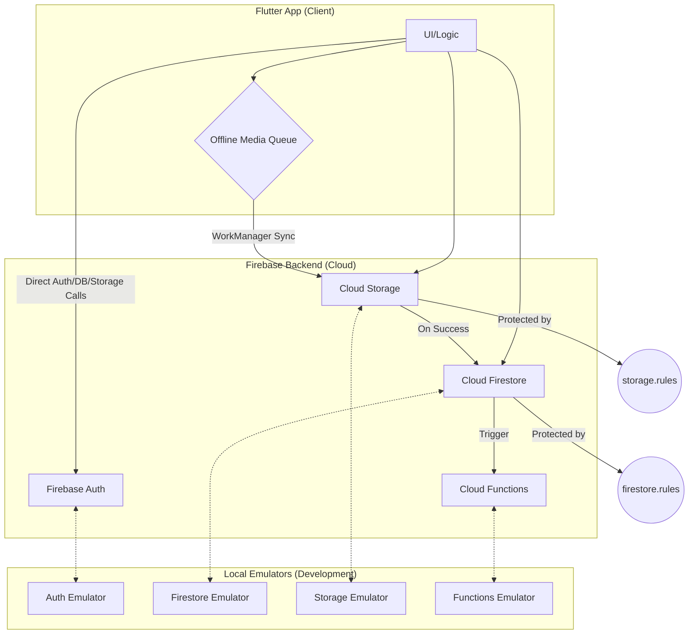

# System Patterns & Architecture

*Last Updated: June 24, 2025*

---

## Core Architecture: Offline-First, Vendor-Centric

The application is built on an offline-first architecture using Flutter for the cross-platform mobile client and Firebase for the backend. The core principle is to ensure vendors can capture and queue media even with poor or no network connectivity.



## Key Components & Patterns

1.  **Flutter Client:**
    -   **State Management:** Riverpod 2 / BLoC Cubit (To be finalized).
    -   **Local Persistence:** `hive` is used for the `pendingMediaQueue` and `userSettings` boxes, providing a fast and reliable local database.
    -   **Background Sync:** `workmanager` is used to create a robust background task that uploads queued media when network connectivity is restored. This is a critical component for the offline-first guarantee.

2.  **Firebase Backend:**
    -   **Authentication:** Firebase Auth is used for user management (Phone/Email OTP). The `request.auth.uid` is the cornerstone of our security rules.
    -   **Database:** Cloud Firestore stores all application metadata (`vendors`, `snaps`, `broadcasts`, `followers`). Access is tightly controlled by `firestore.rules`.
    -   **File Storage:** Cloud Storage is used to store user-generated media (photos/videos). `storage.rules` ensure that only authenticated users can upload to their designated, size-limited paths.
    -   **Serverless Logic:** Cloud Functions (written in TypeScript) are used for backend logic that should not run on the client, such as sending push notifications upon new snap creation.

3.  **Local Development Environment:**
    -   **Firebase Emulator Suite:** We use the full emulator suite for local development. This allows for rapid, offline testing of all backend components, including security rules, database triggers, and functions.
    -   **Configuration:** The emulators are configured in `firebase.json`, with rules defined in `firestore.rules` and `storage.rules`.

## Asset Management
- **Static Assets**: All static assets are managed in the `assets/` directory at the project root.
- **Images**: General images are stored in `assets/images/`.
- **LUTs**: Look-Up Table (LUT) filter images are stored in `assets/images/luts/`. This keeps them organized and separate from other UI-related images.
- **Configuration**: All asset directories must be declared in `pubspec.yaml` under the `flutter.assets` section.

## Background Processing
- Background tasks are handled by the `workmanager` package.
- A single `SyncPendingMediaTask` is registered to handle offline media uploads.
- The task uses an exponential back-off policy for retries.
- Platform-specific implementations are handled within the `BackgroundSyncService`.

## Local Storage
- **Hive**: Used for structured local data storage. Boxes are encrypted.
  - `pendingMediaQueue`: Stores media waiting to be uploaded.
  - `userSettings`: Caches user preferences.
- **Secure Storage**: `flutter_secure_storage` is used to store the encryption key for Hive boxes.

## High‑Level Architecture

```
Flutter App ─ Hive Queue ─ WorkManager → Firebase Storage
                             ↓              ↓
                          Firestore ← Cloud Functions → FCM
                                             ↓
                                 (Phase 2) pgvector + GPT‑4
```

### Key Patterns

- **Offline‑First Queue:** Local Hive box holds media until WorkManager detects acceptable network.
- **Idempotent Uploads:** Each queue item carries UUID; Cloud Function ignores duplicates.
- **TTL‑Based Ephemerality:** `expiresAt` field + Firestore index + scheduled CF cleanup.
- **Fan‑Out Push:** On snap create, `sendFollowerPush` multicasts to FCM tokens stored in `followers` sub‑collection.
- **Feature Flags:** Phase 2 AI endpoints behind remote‑config switch.

## Design Decisions

- **Flutter 3** for single codebase; avoids React Native install size.
- **Hive + Drift** chosen for speed and encryption vs. SQLite.
- **pgvector micro instance** satisfies vector search under budget; fallback Annoy in‑memory.

