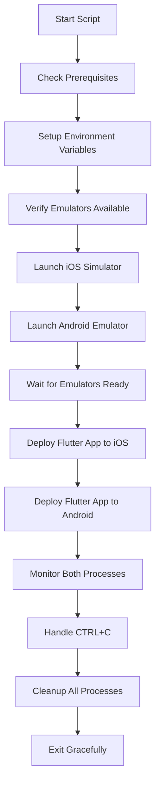

# MarketSnap Development Scripts

This directory contains development automation scripts for the MarketSnap Flutter application.

## 🚀 Quick Start

```bash
# Run the development environment with both iOS and Android emulators
./scripts/dev_emulator.sh
```

## 📜 Available Scripts

### `dev_emulator.sh` - Dual Platform Development Environment

**Enhanced Development Script v3.0** - Launches both iOS and Android emulators simultaneously and runs the Flutter app on both platforms for parallel development and testing with advanced Android detection, smart signal handling, and robust error handling.

#### 🎯 What it does:

1. **Prerequisites Check**: Verifies Flutter, Android SDK, Xcode, and project setup
2. **Environment Setup**: Configures Android SDK paths and environment variables
3. **Smart Emulator Launch**: Intelligent iOS Simulator detection and fast Android Emulator startup
4. **Robust App Deployment**: Advanced Flutter app deployment with multi-pattern device detection
5. **Real-time Process Monitoring**: Enhanced monitoring with status updates and helpful tips
6. **Comprehensive Cleanup**: Proper simulator shutdown and complete process termination

#### 🔧 Requirements:

- **Flutter SDK** (3.8.1 or higher)
- **Xcode** with iOS Simulator
- **Android Studio** with Android SDK
- **Android Emulator**: `Medium_Phone_API_36.0` (or modify script for your AVD)
- **Environment File**: `.env` with Firebase configuration

#### 📱 Supported Emulators:

- **iOS**: `apple_ios_simulator` (iPhone 16 Pro default)
- **Android**: `Medium_Phone_API_36.0` (customizable)

#### 🎮 Usage:

```bash
# Basic usage - launch both platforms
./scripts/dev_emulator.sh

# The script will:
# ✅ Check all prerequisites
# 🍎 Launch iOS Simulator
# 🤖 Launch Android Emulator
# 📱 Deploy Flutter app to both platforms
# 📊 Show real-time status updates
# 🔄 Enable hot reload on both platforms

# To stop Flutter apps and simulators, press CTRL+C
# Note: Simulators remain running until you press CTRL+C
```

#### 📋 Process Flow:



#### 📝 Log Files:

The script generates detailed log files for debugging:

- `scripts/flutter_ios.log` - iOS Flutter app logs
- `scripts/flutter_android.log` - Android Flutter app logs
- Console output - Real-time status and process monitoring

#### 🎨 Enhanced Features:

- **🌈 Colored Console Output**: Different colors for different log levels (INFO, SUCCESS, WARNING, ERROR)
- **⏰ Timestamped Logs**: All log entries include precise timestamps for debugging
- **🔄 Hot Reload Support**: Both platforms support hot reload during development
- **📊 Real-time Monitoring**: Enhanced status updates every 10 seconds with device detection
- **🧹 Comprehensive Cleanup**: Proper iOS Simulator shutdown + complete process termination
- **⚡ Fast Android Boot**: Optimized startup (~10 seconds) with intelligent boot detection
- **🔧 Robust Device Detection**: Multi-pattern Flutter device ID recognition with fallbacks
- **📝 Live Logging**: Real-time logs with `tee` output to both console and files
- **🎯 Smart iOS Handling**: Automatic booted simulator detection or intelligent selection
- **🛡️ Error Resilience**: Enhanced error handling with graceful degradation

#### 🆕 Latest Improvements (v3.0):

**✅ iOS Simulator Cleanup Fixed**
- Proper `xcrun simctl shutdown` command usage
- Complete process termination (both simulator app and instance)
- No more leftover iOS Simulator processes after script exit

**🎯 Advanced Android Detection (v3.0)**
- **Dynamic Device ID Detection**: Automatically detects actual emulator device ID (e.g., emulator-5554)
- **Targeted ADB Commands**: Uses `adb -s device_id` for specific device targeting
- **Intelligent Boot Detection**: Improved logic using `sys.boot_completed` and `dev.bootcomplete` properties
- **Enhanced Debug Logging**: Detailed boot property values for troubleshooting
- **Fast Boot Timeout**: Optimized 10-second detection for quick emulator startup
- **Robust Fallback Detection**: Multiple methods to find Android device in Flutter

**🎯 Robust Flutter Deployment**
- Multi-pattern device ID detection with fallbacks
- Better Flutter device recognition timing
- Real-time log output with `tee` command
- Process validation after deployment start
- Enhanced error handling with graceful degradation

**🛑 Smart Signal Handling (v3.0)**
- **No Automatic Shutdown**: Simulators remain running after successful deployment
- **User-Controlled Cleanup**: Only shuts down simulators when CTRL-C is pressed
- **Signal-Specific Handling**: Responds only to SIGINT (CTRL-C) and SIGTERM, not normal script exit
- **Enhanced Process Management**: Flutter apps can be stopped without shutting down simulators
- **Clear User Communication**: Better messaging about shutdown behavior

**📊 Enhanced Monitoring & Debugging**
- Device detection status in monitoring loop with actual device IDs
- Detailed Android boot property logging for troubleshooting
- Periodic helpful tips during long-running processes
- Better process health verification with specific device targeting
- Comprehensive cleanup verification and status reporting

#### 🛠️ Customization:

Edit the script variables to customize for your setup:

```bash
# Emulator configurations
IOS_EMULATOR_ID="apple_ios_simulator"          # Your iOS simulator ID
ANDROID_EMULATOR_ID="Medium_Phone_API_36.0"    # Your Android AVD name
IOS_DEVICE_NAME="iPhone 16 Pro"                # Preferred iOS device
ANDROID_PORT="5554"                             # Android emulator port
ANDROID_SDK_PATH="$HOME/Library/Android/sdk"   # Android SDK path
```

#### 🚨 Troubleshooting:

**Common Issues:**

1. **Android Emulator Not Found**
   ```bash
   # List available AVDs
   $HOME/Library/Android/sdk/emulator/emulator -list-avds
   
   # Update ANDROID_EMULATOR_ID in script with your AVD name
   ```

2. **Android Detection Issues**
   ```bash
   # Check if ADB can see the emulator
   $HOME/Library/Android/sdk/platform-tools/adb devices
   
   # Check emulator boot properties manually
   $HOME/Library/Android/sdk/platform-tools/adb shell getprop sys.boot_completed
   $HOME/Library/Android/sdk/platform-tools/adb shell getprop dev.bootcomplete
   
   # The script now shows detailed boot property values in debug logs
   ```

3. **iOS Simulator Issues**
   ```bash
   # Reset iOS Simulator
   xcrun simctl erase all
   
   # List available simulators
   xcrun simctl list devices
   ```

4. **Flutter Environment Issues**
   ```bash
   # Check Flutter environment
   flutter doctor -v
   
   # Clean Flutter cache
   flutter clean
   flutter pub get
   ```

5. **Permission Issues**
   ```bash
   # Make script executable
   chmod +x scripts/dev_emulator.sh
   ```

#### 💡 Tips & Best Practices:

- **Hot Reload**: Press `r` in either Flutter console to hot reload
- **Hot Restart**: Press `R` in either Flutter console to hot restart  
- **Live Log Monitoring**: Use `tail -f scripts/flutter_ios.log` and `tail -f scripts/flutter_android.log`
- **Fast Iteration**: Android emulator optimized for 10-second boot detection
- **Multiple Terminals**: Open additional terminals to interact with each platform separately
- **Performance Optimization**: Close other applications to free up resources for emulators
- **Simulator Management**: iOS Simulator automatically detects booted devices or boots preferred one
- **Smart Cleanup**: Use CTRL+C to terminate Flutter apps and shutdown simulators - simulators stay running otherwise
- **Device Detection**: Script waits for Flutter to recognize both devices before app deployment

#### 🔐 Security:

- The script automatically loads environment variables from `.env`
- Firebase configuration is loaded securely at runtime
- No hardcoded secrets in the script
- Process isolation for each platform

#### 📊 Performance Monitoring & Optimizations:

**Real-time Monitoring:**
- Process status (Running/Stopped) with PID tracking
- Flutter device recognition status  
- Emulator boot progress with time estimates
- Log file locations and monitoring tips

**Performance Optimizations:**
- **Fast Android Boot**: 30-second timeout vs previous 180 seconds
- **Smart iOS Detection**: Reuses already booted simulators
- **Optimized Emulator Settings**: No data wipe, GPU acceleration, no boot animation
- **Enhanced Device Detection**: Multi-pattern recognition with intelligent fallbacks
- **Live Process Validation**: Verifies Flutter processes are actually running after start

**Monitoring Features:**
- Device detection status every 60 seconds
- Helpful tips shown periodically during monitoring
- Real-time log output with `tee` for both console and file logging
- Comprehensive process health checks with automatic cleanup

---

## 🤝 Contributing

When adding new scripts:

1. Follow the same logging and error handling patterns
2. Include comprehensive documentation
3. Add cleanup functions for proper resource management
4. Test on both macOS and different development environments
5. Update this README with new script documentation

## 📄 License

This script is part of the MarketSnap project and follows the same licensing terms. 