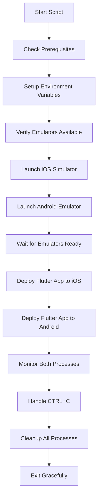

# MarketSnap Development Scripts

This directory contains development automation scripts for the MarketSnap Flutter application.

## 🚀 Quick Start

```bash
# Run the development environment with both iOS and Android emulators
./scripts/dev_emulator.sh
```

## 📜 Available Scripts

### `dev_emulator.sh` - Dual Platform Development Environment

Launches both iOS and Android emulators simultaneously and runs the Flutter app on both platforms for parallel development and testing.

#### 🎯 What it does:

1. **Prerequisites Check**: Verifies Flutter, Android SDK, Xcode, and project setup
2. **Environment Setup**: Configures Android SDK paths and environment variables
3. **Emulator Launch**: Starts both iOS Simulator and Android Emulator
4. **App Deployment**: Runs Flutter app on both platforms with hot reload enabled
5. **Process Monitoring**: Continuously monitors app status on both platforms
6. **Cleanup Handling**: Gracefully shuts down all processes on CTRL+C or exit

#### 🔧 Requirements:

- **Flutter SDK** (3.8.1 or higher)
- **Xcode** with iOS Simulator
- **Android Studio** with Android SDK
- **Android Emulator**: `Medium_Phone_API_36.0` (or modify script for your AVD)
- **Environment File**: `.env` with Firebase configuration

#### 📱 Supported Emulators:

- **iOS**: `apple_ios_simulator` (iPhone 16 Pro default)
- **Android**: `Medium_Phone_API_36.0` (customizable)

#### 🎮 Usage:

```bash
# Basic usage - launch both platforms
./scripts/dev_emulator.sh

# The script will:
# ✅ Check all prerequisites
# 🍎 Launch iOS Simulator
# 🤖 Launch Android Emulator
# 📱 Deploy Flutter app to both platforms
# 📊 Show real-time status updates
# 🔄 Enable hot reload on both platforms

# To stop everything, press CTRL+C
# The script will automatically cleanup all processes
```

#### 📋 Process Flow:



#### 📝 Log Files:

The script generates detailed log files for debugging:

- `scripts/flutter_ios.log` - iOS Flutter app logs
- `scripts/flutter_android.log` - Android Flutter app logs
- Console output - Real-time status and process monitoring

#### 🎨 Features:

- **🌈 Colored Console Output**: Different colors for different log levels
- **⏰ Timestamped Logs**: All log entries include precise timestamps
- **🔄 Hot Reload Support**: Both platforms support hot reload during development
- **📊 Real-time Monitoring**: Continuous status updates every 10 seconds
- **🧹 Automatic Cleanup**: Graceful shutdown of all processes and cleanup
- **⚡ Fast Recovery**: Automatic retry and error handling
- **🔧 Detailed Debugging**: Verbose logging for troubleshooting

#### 🛠️ Customization:

Edit the script variables to customize for your setup:

```bash
# Emulator configurations
IOS_EMULATOR_ID="apple_ios_simulator"          # Your iOS simulator ID
ANDROID_EMULATOR_ID="Medium_Phone_API_36.0"    # Your Android AVD name
IOS_DEVICE_NAME="iPhone 16 Pro"                # Preferred iOS device
ANDROID_PORT="5554"                             # Android emulator port
ANDROID_SDK_PATH="$HOME/Library/Android/sdk"   # Android SDK path
```

#### 🚨 Troubleshooting:

**Common Issues:**

1. **Android Emulator Not Found**
   ```bash
   # List available AVDs
   $HOME/Library/Android/sdk/emulator/emulator -list-avds
   
   # Update ANDROID_EMULATOR_ID in script with your AVD name
   ```

2. **iOS Simulator Issues**
   ```bash
   # Reset iOS Simulator
   xcrun simctl erase all
   
   # List available simulators
   xcrun simctl list devices
   ```

3. **Flutter Environment Issues**
   ```bash
   # Check Flutter environment
   flutter doctor -v
   
   # Clean Flutter cache
   flutter clean
   flutter pub get
   ```

4. **Permission Issues**
   ```bash
   # Make script executable
   chmod +x scripts/dev_emulator.sh
   ```

#### 💡 Tips:

- **Hot Reload**: Press `r` in either Flutter console to hot reload
- **Hot Restart**: Press `R` in either Flutter console to hot restart  
- **Multiple Terminals**: Open multiple terminals to interact with each platform separately
- **Log Monitoring**: Use `tail -f scripts/flutter_ios.log` to monitor iOS logs in real-time
- **Performance**: Close other applications to free up resources for emulators

#### 🔐 Security:

- The script automatically loads environment variables from `.env`
- Firebase configuration is loaded securely at runtime
- No hardcoded secrets in the script
- Process isolation for each platform

#### 📊 Performance Monitoring:

The script provides real-time monitoring:
- Process status (Running/Stopped)
- Process IDs for debugging
- Memory and CPU usage warnings
- Automatic restart on process failure

---

## 🤝 Contributing

When adding new scripts:

1. Follow the same logging and error handling patterns
2. Include comprehensive documentation
3. Add cleanup functions for proper resource management
4. Test on both macOS and different development environments
5. Update this README with new script documentation

## 📄 License

This script is part of the MarketSnap project and follows the same licensing terms. 